# Отчет о прохождении 3 этапа внешних курсов 

## Топорова Дарья Сергеевна, НММбд-03-24


# Цель работы

Ознакомиться с функционалом операционной системы Linux.

# Задание

Просмотреть видео и на основе полученной информации пройти тестовые задания.


# Выполнение лабораторной работы


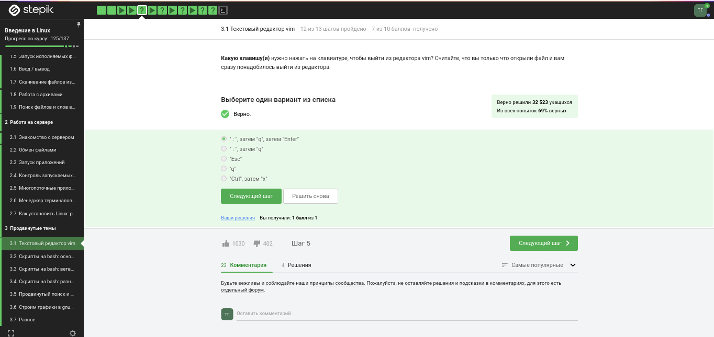

Стоит упомянуть, что у редактора vim есть туториал, который позволяет разобраться с командами, необходимыми для стандартной работы. 
За выход из редактора отвечают следующие команды:

- ZQ - выйти без сохранения
- :q! - выйти без сохранения
- ZZ - записать файл и выйти (если файл не изменяли, то записываться он не будет)
- :wq - записать файл и выйти
- :x - записать файл и выйти
- :w<CR> - записать файл
- :sav filename<CR> - "сохранить как"
- :w filename<CR> - "сохранить как"
- :w!<CR> - записать файл

Как мы видим, вариантов много, при этом каждый сможет найти тот, который подойдёт под конкретную ситуацию.


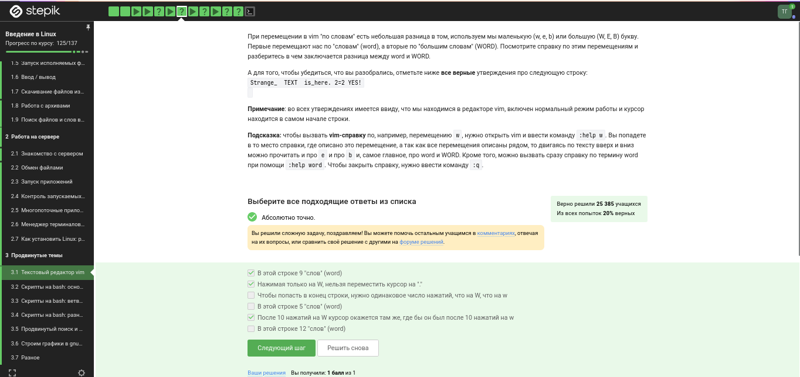

`Strange_  TEXT  is_here. 2=2 YES!`

Точка считается "маленьким словом", так что всего их 9:
`Strange_`, `is_here`, `.`, `2`, `=`, `2`, `!` и `два лишних пробела`.

И если посчитать нажатия на w и на W, то действительно после 10 штук попадем в одно место. 10 нажатий на W, это то же самое, что и 10 нажатий на w,


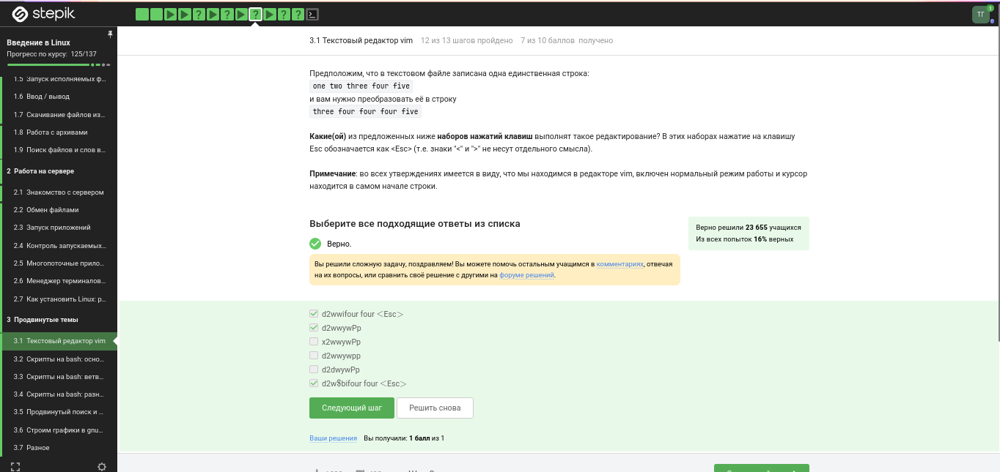

`d2wwifour four <<Esc>>`

`d2wwywPp`

`d2w$$bifour four <<Esc>>`

- $ — в конец текущей строки;
- w — на слово вправо;
- b — на слово влево;
- i — начать ввод перед курсором;
- p — вставка содержимого неименнованного буфера под курсором;
- P — вставка содержимого неименованного буфера перед курсором;
- yy (также Y) — копирование текущей строки в неименованный буфер;
- y<число>y — копирование числа строк начиная с текущей в неименованный буфер;

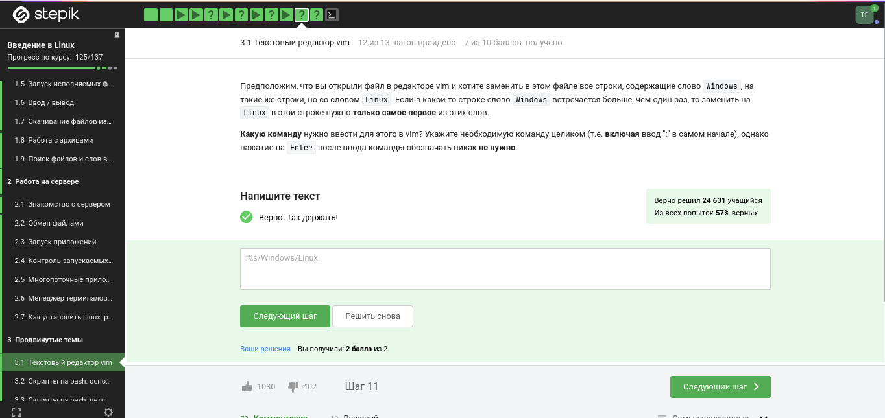

Поиск и замена в редакторе работают по следующей схеме:

`:{пределы}s/{что заменяем}/{на что заменяем}/{опции}`

Для замены во всем файле можно использовать символ %.


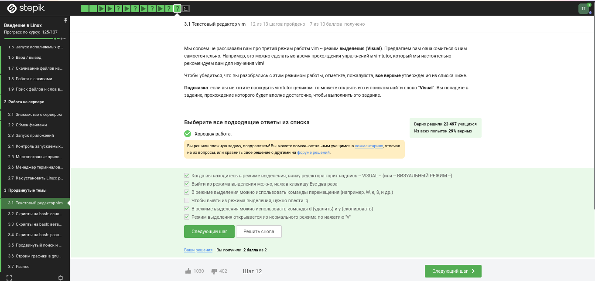

Команда $ — в конец текущей строки, W - до пробела вправо - то есть, перемещение.

Нажать Esc достаточно один раз, но да ладно.

Надпись visual - горит.

d — используется совместно с командами перемещения. Удаляет символы с текущего положения курсора до положения после ввода команды перемещения.

yy (также Y) — копирование текущей строки в буфер;


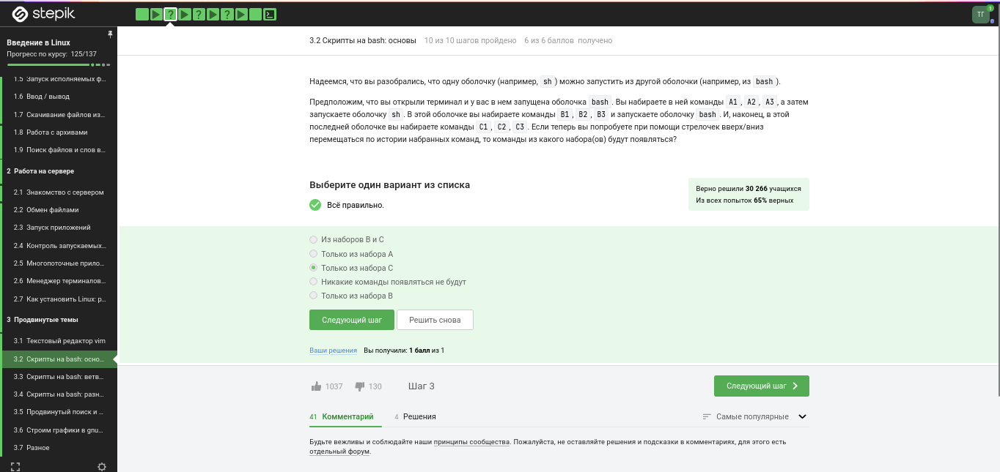

Только из набора С потому что у каждой оболочки свой буфер, который при выходе из нее буде записываться в файл истории.

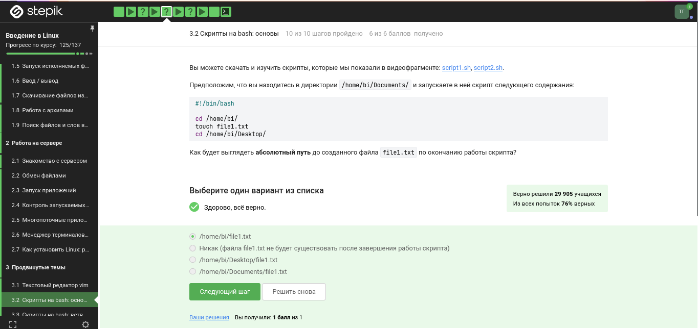

`/home/bi/file1.txt` - потому что именно в этой директории мы создаем новый файл, а уже после его создания мы переходим в другую папку.


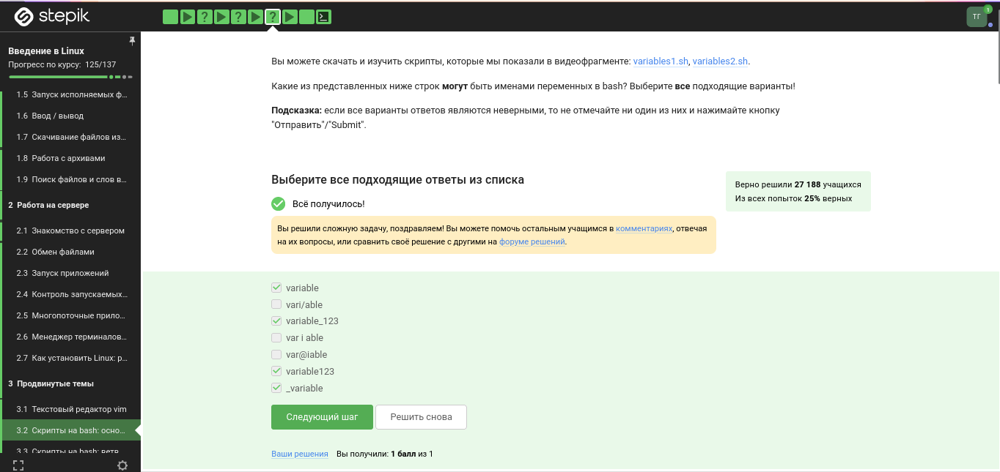

Имя не может начинаться с цифры, содержать специальные символы или пробелы.

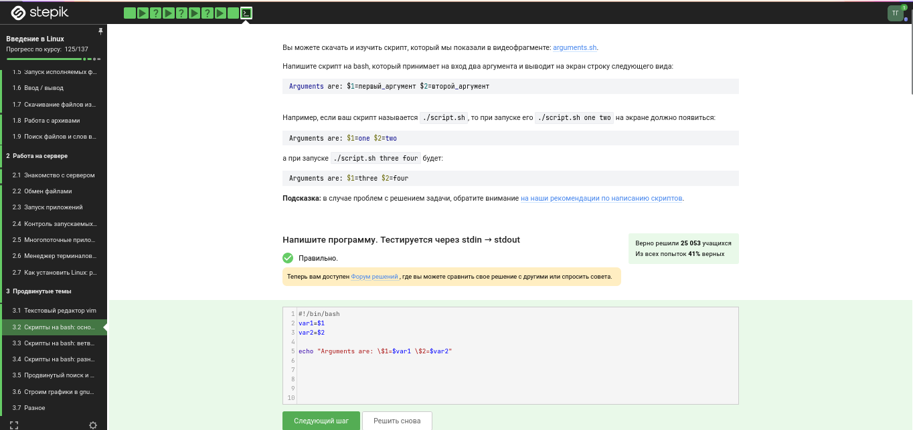

`$ echo опции строка`
Эта команда печатает строки, которые передаются в качестве аргументов в стандартный вывод и обычно используется в сценариях оболочки для отображения сообщения или вывода результатов других команд.

`var1=$1` - обозначение переменных

`var2=$2`

`echo "Arguments are: \$1=$var1 \$2=$var2"` - строка печати.

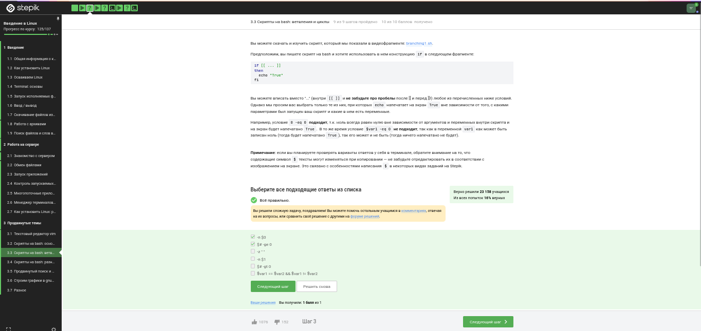

- $0 - имя скрипта
- $# - вернет количество аргументов
- -ge - больше или равно
- -n <string> - не пустая строка.

Имя скрипта - это не пустая строка.

$# Это число аргументов без учета имени скрипта, который всегда $0. И число аргументов всегда будет или равно нулю, или больше него, тк просто не может скатиться в отрицательную сторону.


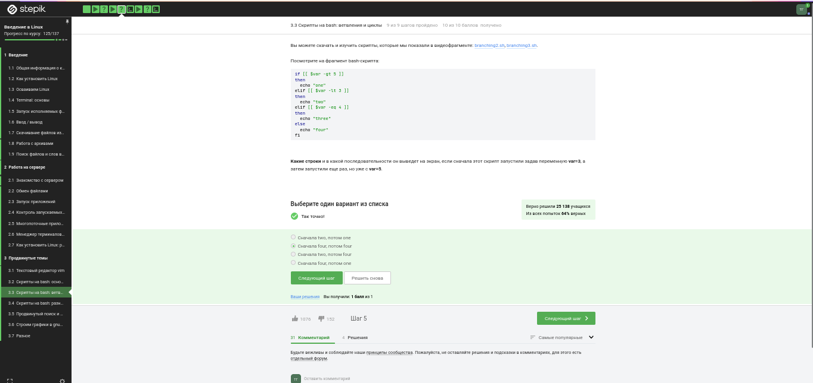

- -lt, (<) - меньше
- -gt - больше
- -eq - равно

3 не больше 5, 3 не меньше 3, 3 не равно 4.

5 не больше 5, 5 не меньше 3, 5 не равно 4.

Оба раза выведет four.


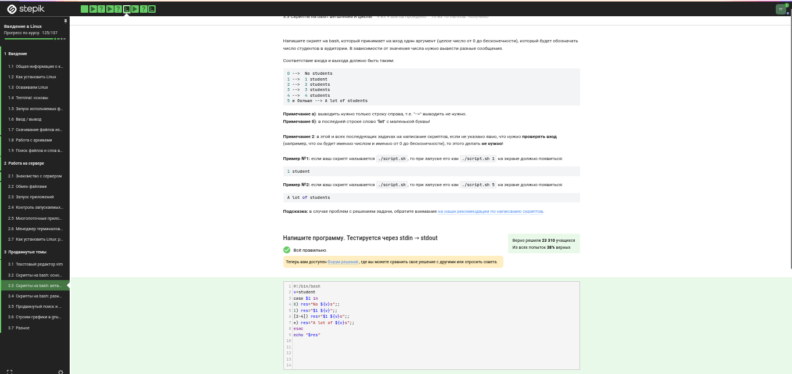

1. Задаю общую часть в каждом выводе - слово "student": v=student
2. Выполняем команды для разных аргументов.
3. res - это результат для вывода
4. echo "$res" - вывести результат

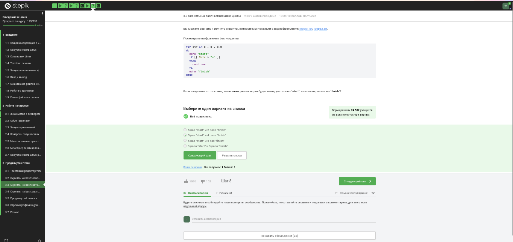

- (Start)
- a > c нет (Finish) 
- (Start)
- , > c нет (Finish) 
- (Start)
- b > c нет (Finish) 
- (Start)
- , > c нет (Finish) 
- (Start)
- c_d > c да


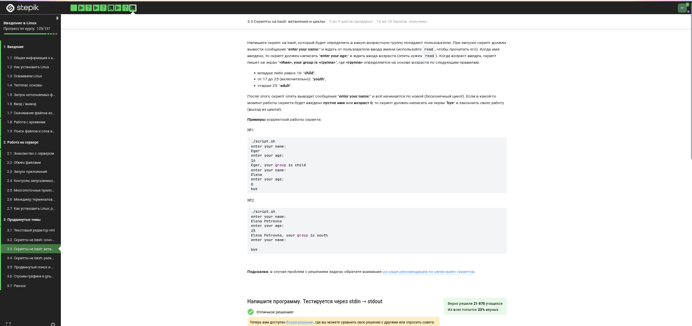

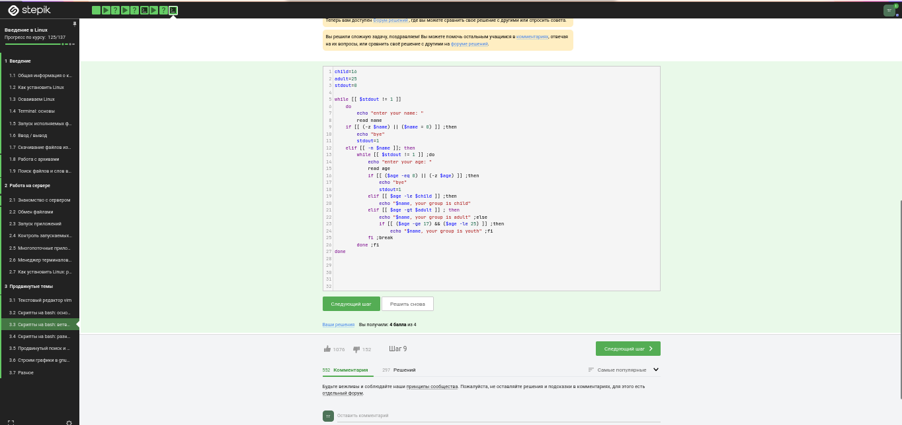

```
child=16
adult=25
stdout=0

while [[ $stdout != 1 ]] #конструкция типа while-True
    do
        echo "enter your name: " #Пользователь вводит имя
        read name
    if [[ (-z $name) || ($name = 0) ]] ;then #Если имя не по параметрам, простимся
        echo "bye"
        stdout=1
    elif [[ -n $name ]]; then #А вот если имя нормальное
        while [[ $stdout != 1 ]] ;do 
            echo "enter your age: " #То пусть вводит возраст
            read age #Считываем возраст
            if [[ ($age -eq 0) || (-z $age) ]] ;then #Если возраст 0 или строка пуста - прощаемся
                echo "bye"
                stdout=1
            elif [[ $age -le $child ]] ;then #Если меньше или равен ребенку, то ребенок
                echo "$name, your group is child"
            elif [[ $age -gt $adult ]] ; then #Больше взрослого - то взрослый
                echo "$name, your group is adult" ;else
                if [[ ($age -ge 17) && ($age -le 25) ]] ;then #Если от 17 до 25, то подросток.
                    echo "$name, your group is youth" ;fi
            fi ;break
        done ;fi
done

```

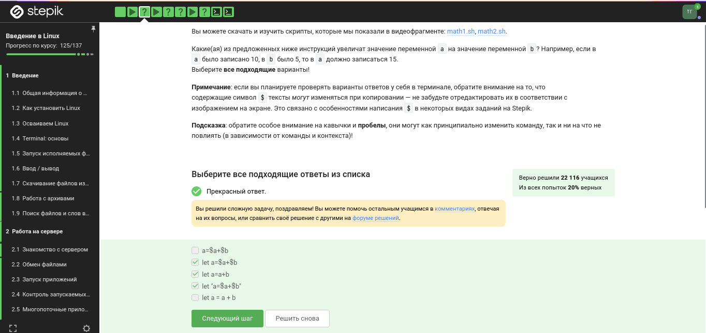

1. a = $a

2. a += b это то же самое, что и a = a + b, но с символами "+=" != "=+"

3. если выражение не в скобках, но с пробелами - работать не будет. (let a=a+b - сработает; let a = a + b - нет)

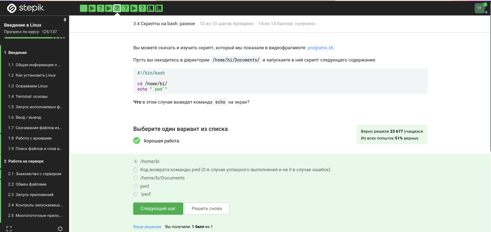

Выведет путь до директории, в которую мы перешли, так как "```pwd```" - это команда

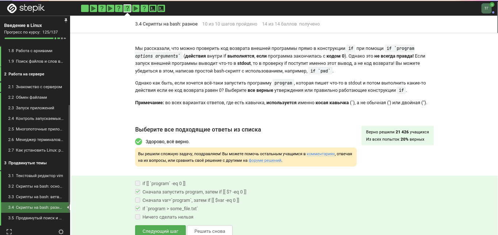

`programm`  выполняет стандартный вывод в терминал (если это принцип работы программы). И нам нужно настроить вывод в файл.

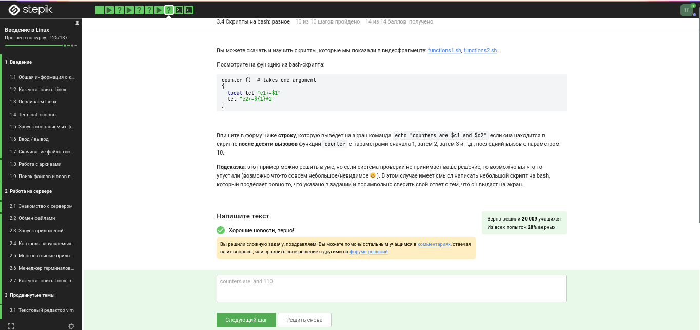

Первая переменная локальная, и это просто пустая строка, вторая переменная - это сумма арифметической прогрессии от 1 до 10, равна 55, но при умножении на 2 даст 110.


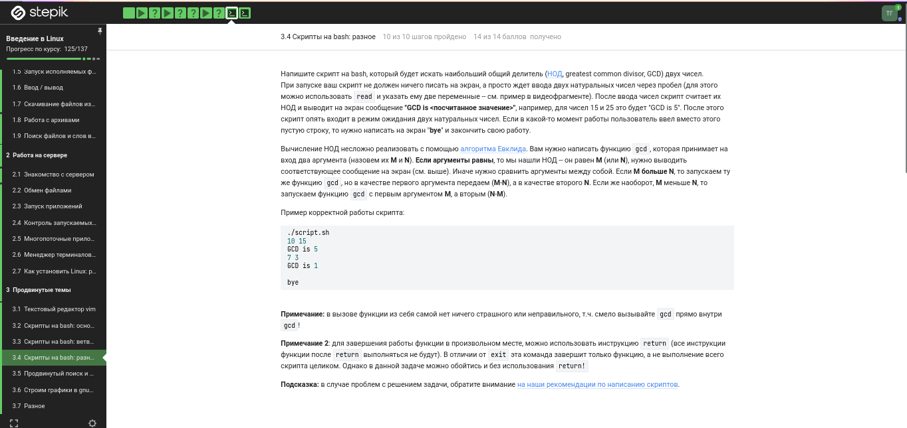


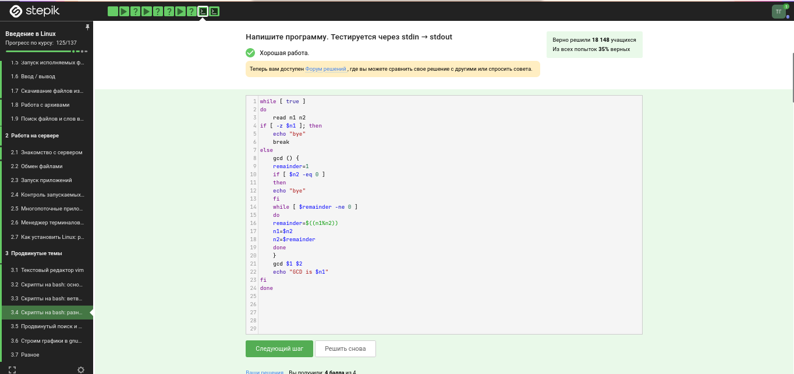

Алгоритм нахождения НОД делением

1. Большее число делим на меньшее.
2. Если делится без остатка, то меньшее число и есть НОД (следует выйти из цикла).
3. Если есть остаток, то большее число заменяем на остаток от деления.
4. Переходим к пункту 1.


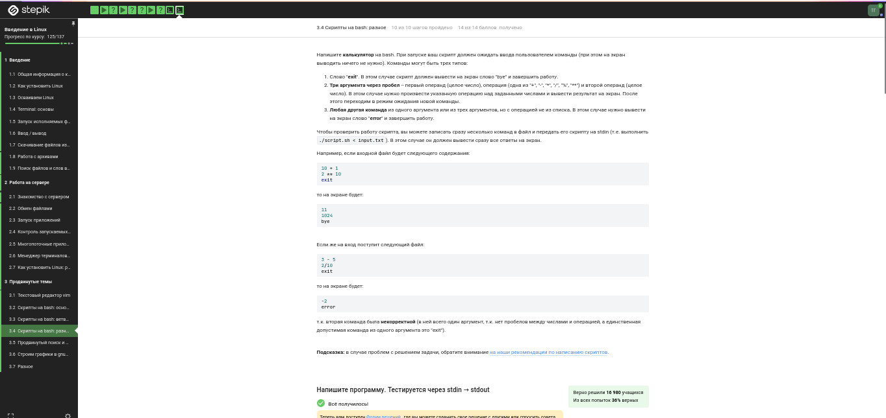

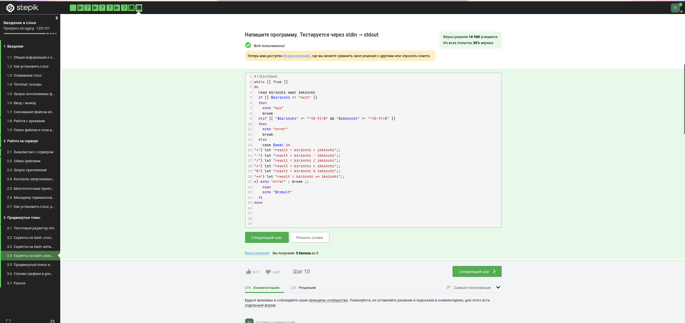

Калькулятор выглядит обычно - мы вводим два числа, пишем, что с ними надо сделать, и потом, учитывая случаи ошибок, выводим результат.

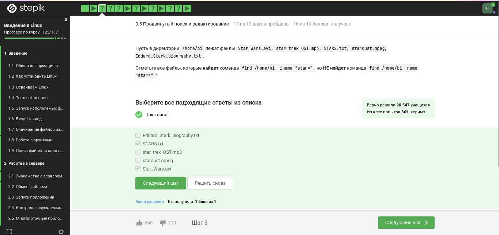

-iname ищет без учета регистра, а -name в точности как в запросе. Звездочка стоит после слова - это значит после слова может быть сколько угодно символов.

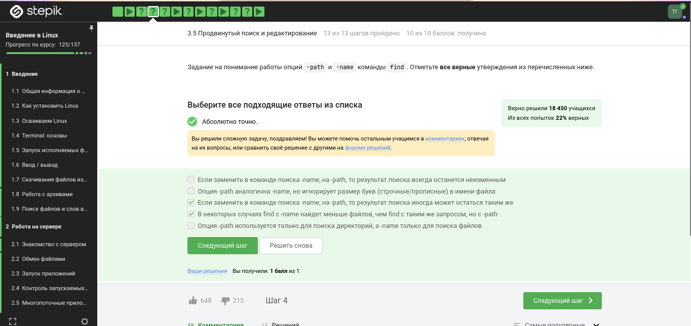

find [path] [expression]

где: path - это путь к директории, в которой нужно выполнить поиск файлов (по умолчанию, поиск производится в текущей директории и всех ее поддиректориях);

expression - это выражение, которое определяет критерии поиска файлов.

-name: поиск файлов по имени. Например: find /home/user -name myfile.txt

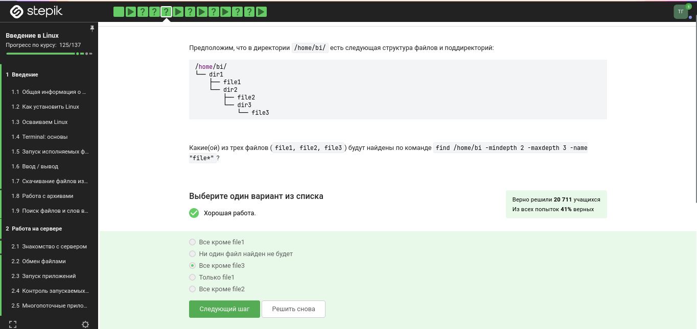

Текущий каталог - это depth=1, а остальное считается просто:

/home/bi   -> depth=1

/home/bi/dir1   -> depth=2

/home/bi/dir1/dir2   -> depth=3


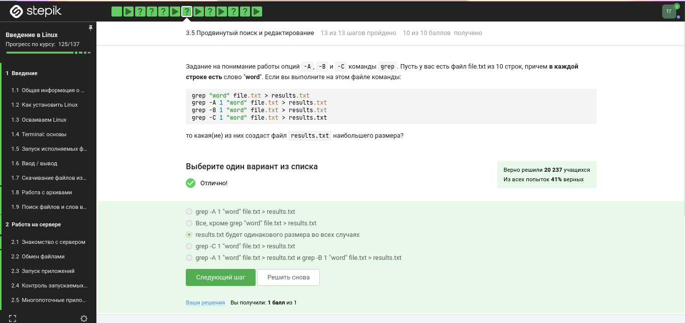

Из описания man:
Print NUM lines of trailing context after/before matching lines
"matching lines" - множественное число, строки в которых нашлось совпадение

Т.е. если идут 2...10...100 строк подряд, в которых обнаружилось совпадение, контекст будет выведен до и после этой ГРУППЫ строк, а не до и после каждой строки в этой группе

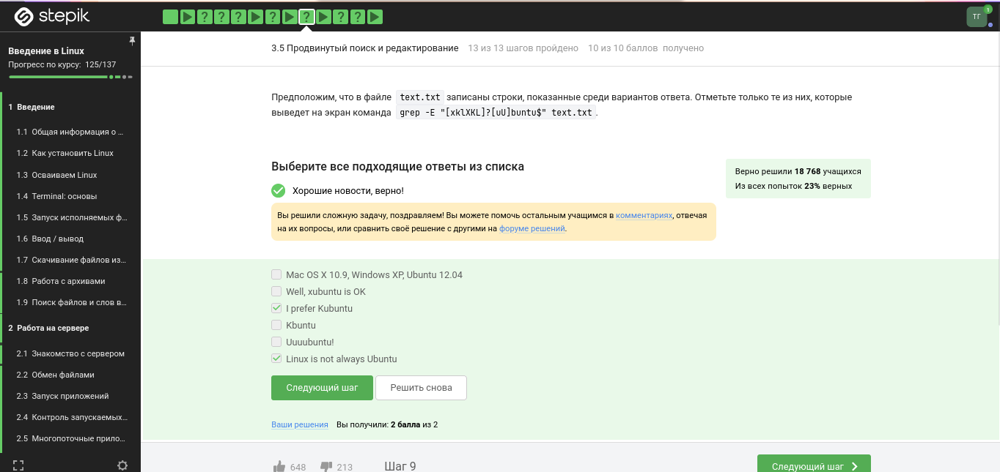

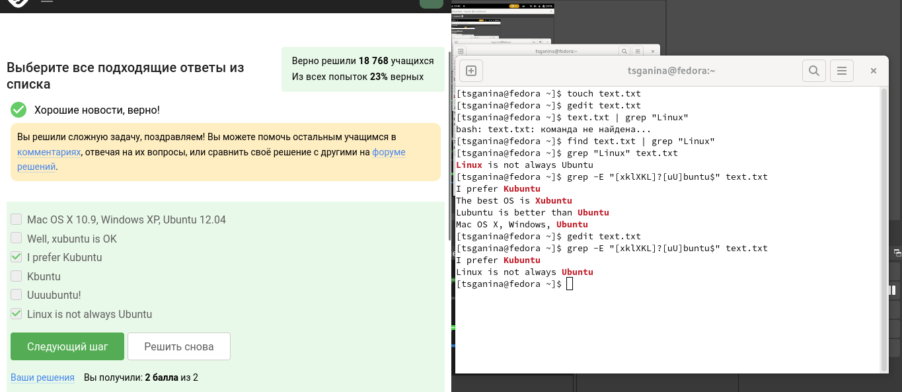

Объяснение на втором скриншоте.

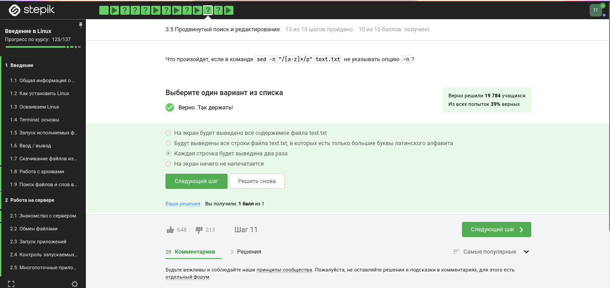

The -n option disables the automatic printing, which means the lines you don't specifically tell it to print do not get printed, and lines you do explicitly tell it to print (e.g. with p) get printed only once. 


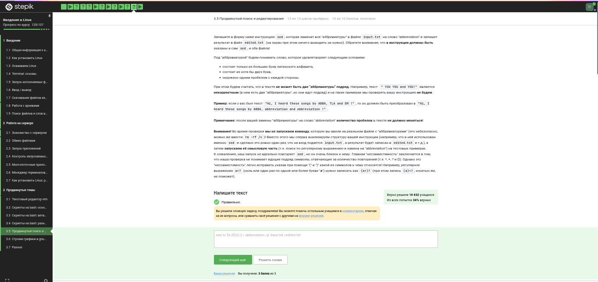

аббревиатура ABBA отличается от двух других аббревиатур тем, что справа он неё стоит запятая без пробела: "ABBA,". 

При этом по условию аббревиатура должна выглядеть как [ XX ] или [ XXX ] (и ещё больше X). Следовательно, для этой проверки надо добавить пробел квадратными скобками [ ] слева и, соответственно, с права.


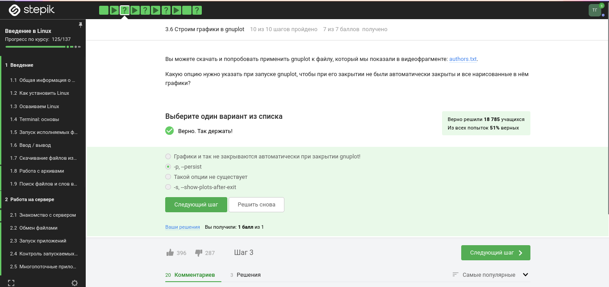

-persist lets plot windows survive after main gnuplot program exits. 


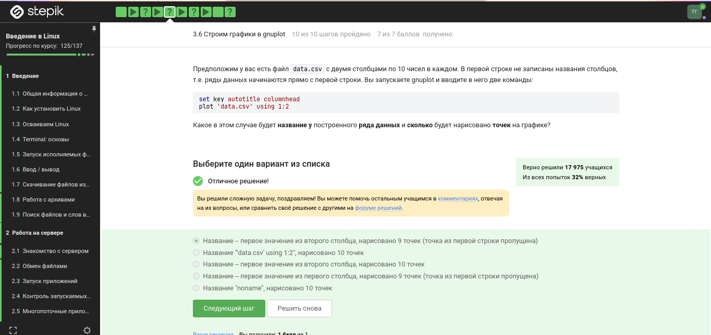

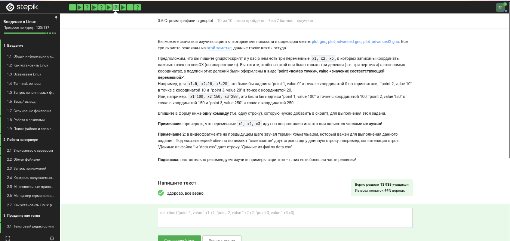

Cначала идет команда установки подписей, а потом в скобках:

подпись - пробел - переменная с координатой - запятая

Повторяется это количество раз соответствующее числу переменных, и без запятой (в случае с последней переменной)

А подпись в свою очередь получается конкатенацией текста из задания и переменной с координатой.

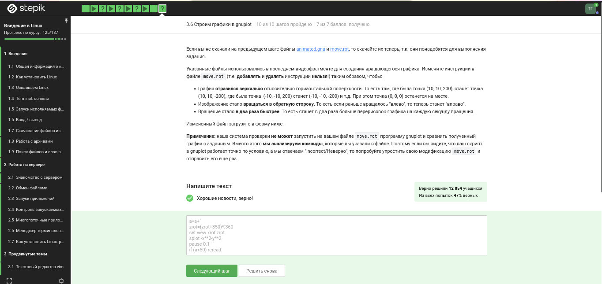

1. График строится строкой "splot x**2+y**2". 
2. Вращение задается строкой "zrot=(zrot+10)%360". Значит, смещение вперед (которое было изначально) можно также задать строкой "zrot=(zrot+360+10)%360" или иначе говоря "zrot=(zrot+370)%360". А теперь посмотрим на наше требование - чтоб вращалось в другую сторону, значит, по аналогии, необходимо вместо перебора на 10 сделать недобор. 

"zrot=(zrot+350)%360"

3. Строка "pause 0.2" ставит выполнение на паузу на определенный промежуток времени. В задании сказали перерисовывать чаще, значит пауза должна быть меньше.

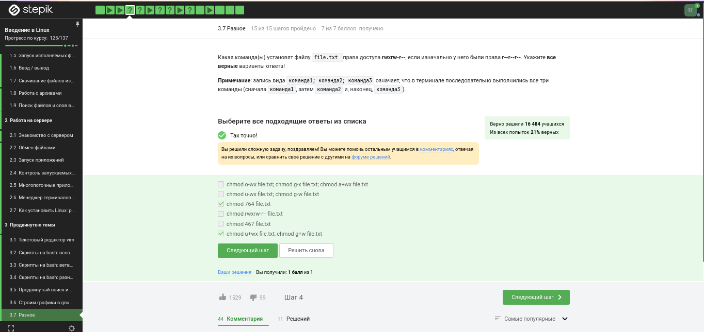


- r - чтение;
- w - запись;
- x - выполнение;
- s - выполнение  от имени суперпользователя (дополнительный);

- u - владелец файла;
- g - группа файла;
- o - все остальные пользователи;


- 0 - никаких прав;
- 1 - только выполнение;
- 2 - только запись;
- 3 - выполнение и запись;
- 4 -  только чтение;
- 5 - чтение и выполнение;
- 6 - чтение и запись;
- 7 - чтение запись и выполнение.

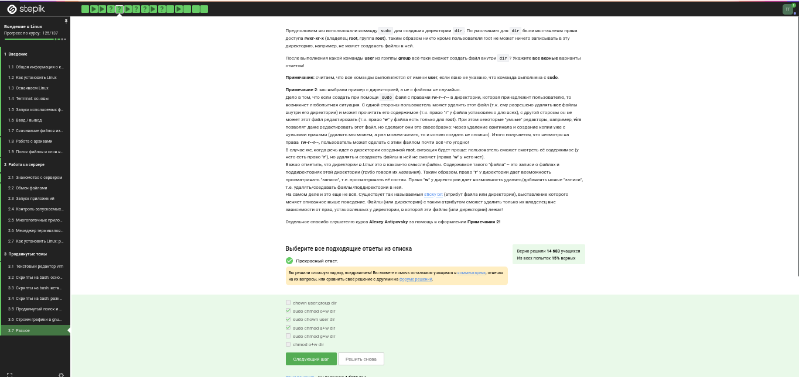

Решений два типа:

- Сменить права гостей, добавив W
- Сделать владельцем нужную группу или пользователя, в зависимости от того, у кого из них уже есть права на W
- Помнить, что root - владелец и остальные для него - others.

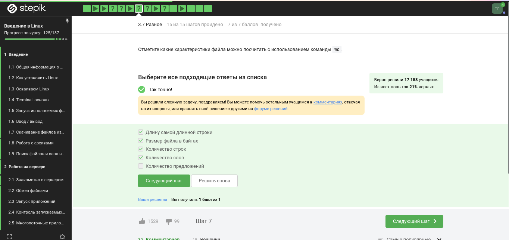

- wc -l <filename> вывести количество строк
- wc -c <filename> вывести количество байт
- wc -m <filename> вывести количество символов
- wc -L <filename> вывести длину самой длинной строки
- wc -w <filename> вывести количество слов

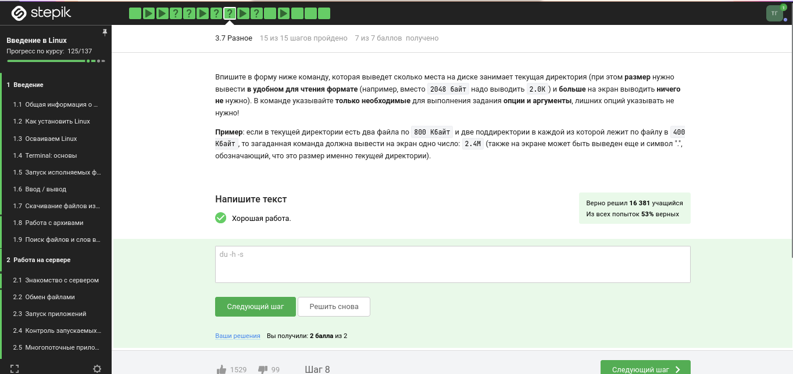
-h, --human-readable
    print sizes in human readable format (e.g., 1K 234M 2G)
    
-s, --summarize
    display only a total for each argument 

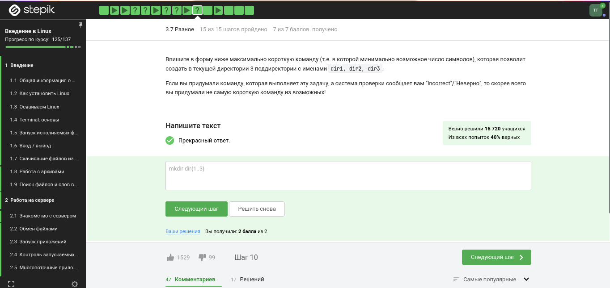

Команда создаст три директории от dir1 до dir3. 

# Сертификат

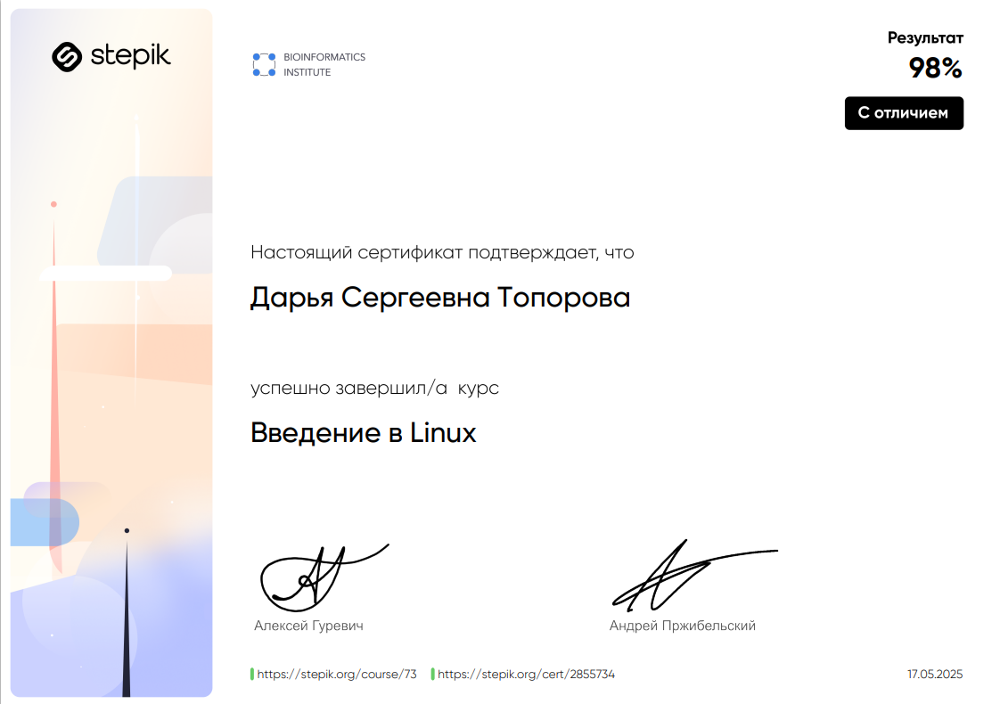

# Выводы

Я просмотрела курс и освежила в памяти навыки работы с более сложными командами в Линукс.

